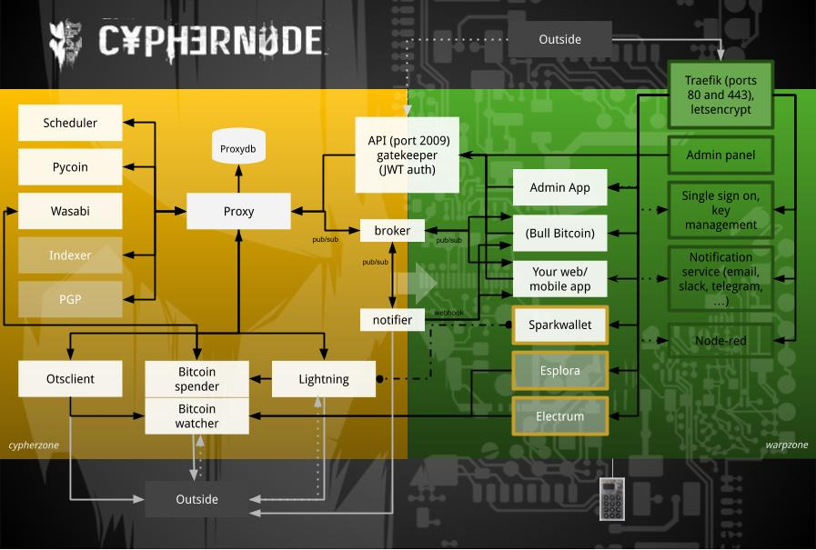

# The Cyphernode Project

Cyphernode is a Bitcoin microservices API server architecture, Bitcoin wallet management software and utilities toolkit to build scalable, secure and featureful apps and services without trusted third parties.

Combined with the Cypherapps framework, Cyphernode provides all advanced features and utilities necessary to build and deploy entreprise-grade applications such as Bitcoin exchanges, Bitcoin payment processors and Bitcoin wallets.

- Designed for Bitcoin builders: app devs, project managers, founders, R&D, prototypers, etc.
- Use your own full nodes exclusively: Bitcoin, Lightning and Liquid network
- Hold your own keys without compromise: hot wallets and cold store both supported
- Protect user privacy: 100% anonymous, no data leaks to 3rd parties

* Created by Francis Pouliot and Kexkey
* Financed by Bull Bitcoin 
* Contributors: SKP, Sifir, Veriphi

Cyphernode has been used in production by Bull Bitcoin and Bylls since June 2018 for all of its Bitcoin transactions (hundrends of thousands) in and out. We haven't had any major problem (no loss of funds). Use at your own risk. We operated on a skin-in-the-game basis.

Changes are marged into the master branch if, and only if, they have been thouroughly tested in production by Bull Bitcoin and Bylls for at least a few weeks. Often, some of the experimental feature branches are run for months before they are merged into dev, from where they are merged into master.

## Who is this for?

Cyphernode is designed specifically for Bitcoin applications and advances services:

- Build a Bitcoin payment processing application or Bitcoin exchange
- Build an end-user Bitcoin wallet UI, Bitcoin Node dashboard UI, wallet balance tracker, etc.
- Integrate Bitcoin withdrawal and deposit mechanisms in your app
- Build an entreprise hot wallet with multiple balances and user access
- Any app or service that requires your to send bitcoin, receive bitcoin, or track bitcoin transactions or balances
- Advanced features like automated conjoin transactions, multiple transaction hops 
- Liquid Network Bitcoin wallet management, payment processing, transaction notifications, asset issuance, etc.

## Alternatives and substitutes

Cyphernode is a self-hosted alternative to hosted, 3rd party hot-wallet and block explorer APIs such as:
- Bitgo
- Blockchain(dot)info
- Bitpay
- Coinbase
- Blockcypher

It is a more modular, generaic and lightweight substitute to other self-hosted software projects such as:

- BTCPAY server: Cyphernode is a much more generic software project not made specifically for merchants, and does not have a user interface.
- Electrum server: Cyphernode is designed first and foremost as an entreprise-grade API, not wallet backend.
- Blockstream esplora: Most apps and services do not need a full block explorer, because they are only interested in their own transactions and the transactions of their users, not the entire network.

# Cyphernode Architecture



Cyphernode is an assembly of Docker containers being called by a request dispatcher.

- The request dispatcher (requesthandler.sh) is the HTTP entry point.
- The request dispatcher is stateful: it keeps some data to be more effective on next calls.
- The request dispatcher is where Cyphernode scales with new features: add your switch, dispatch requests to your stuff.
- We are trying to construct each container so that it can be used separately, as a standalone reusable component.

## Documentation

- Read the API Documentation: https://github.com/SatoshiPortal/cyphernode/blob/master/doc/API.v0.md
- Installation documentation: https://github.com/SatoshiPortal/cyphernode/blob/master/doc/INSTALL.md
- How to use the Batching: https://github.com/SatoshiPortal/cyphernode/blob/master/doc/BATCHING.md
- General readme: https://github.com/SatoshiPortal/cyphernode/blob/master/doc/README.md

## Ingredients

Cyphernode incorporates the following software projects:

- Bitcoin Core
- C-Lightning
- Wasabi Wallet
- Spark Wallet
- Specter-Desktop
- Elements 
- OpenTimestamps
- Pycoin 
- Tor
- Docker 
- Traefik


## Requirements

Cyphernode is designed to be deployed on virtual machines with launch scripts, but with efficiency and minimalism in mind so that it can also run on multiple Rasberry Pi with very low computing ressources (and extremely low if installing pre-synchronized blockchain and pruned). Because of the modular architecture, heavier modules like blockchain indexers are optional (and not needed for most commercial use-cases).

* For a full-node and all modules: 400 GB of storage and 2GB of RAM minimum
* When adding other modules like Lightning, Coinjoin, other cypherapps, etc. you will need to increase RAM.

## Key code components

**Center element: [proxy_docker](https://github.com/FrancisPouliot/cyphernode/tree/docs/proxy_docker)**
The proxy_docker is the container receiving and dispatching calls from clients. When adding a feature to Cyphernode, it is the first part to be modified to integrate the new feature.
**[Request handler](https://github.com/FrancisPouliot/cyphernode/tree/docs/proxy_docker)**
You will find in there the switch statement used to dispatch the requests. Just add a case block with your command, using other cases as examples for POST or GET requests.
**[Config Schema](https://github.com/SatoshiPortal/cyphernode/blob/f9cf6125cbecae609c95dc9b14f46060b918be31/cyphernodeconf_docker/schema/config-v0.2.4.json)**
The configs which can be edited
**[API permissions](https://github.com/SatoshiPortal/cyphernode/blob/master/api_auth_docker/api-sample.properties)**
This shows all the functions that can be called and the required permissions
**[Proxy data](https://github.com/SatoshiPortal/cyphernode/tree/master/proxy_docker/app/data)**
watching.sql contains the data model. Called "watching" because in the beginning of the project, it was only used for watching addresses. Now could be used to index the blockchain (build an explorer) and add more features.
**[cron_docker](https://github.com/SatoshiPortal/cyphernode/tree/master/cron_docker)**
If you have jobs to be scheduled, use this container. Just add an executable and add it to the crontab.
**[Cyphernode scripts](https://github.com/FrancisPouliot/cyphernode/tree/docs/proxy_docker/app/script)**
Cyphernode features and functions

## Cyphernode request handler and API

The core component of cyphernode is a request handler which exposes HTTP endpoints via REST API, acting as an absctration layer between your apps and the open-source Bitcoin sofware you want to interact with.

- making a delegated request (call) to the functions of the P2P network nodes part of your overlay network (e.g. calling Bitcoin RPC)
- directly using scripts and functions with your data, parameters and configs (e.g. derive segwit addresses from Master Public Key, interacting with C-Lightning command line to create and pay a Bolt11 invoice, stamp and verify a file using OpenTimestamps, etc.)
- executing one of the custom script (function) which will make multiple requests to multiple docker containers based on the desired outcome (e.g. add transctions to a batch, sign and broadcast according to your custom schedule).
- changing the configurations and parameters of the underlying sofware or the request dispatcher 
- deploying and activating components like the cron container which schedules certain tasks/calls
- create webhooks with active watch so that your app receives notifications via asynchronous callback
- sending eventmessages to the cyphernode pub/sub system to trigger other events
- making requests to a cypherapp within the cyphernode network, either from the outside via the API or from other apps within the network

# Cypherapps

Cypherapps are regular software applications that are dockerized and deployed to communicate in a secure way with the rest of the cyphernode stack, and particularly with the broker/notifier and proxy to either get notifications or control the wallets. 

You can communicate with the cypherapps from your other apps through the API. You can essentially use the cypherapp framework to deploy any backend app, or front-end app, that needs to communicate with some Bitcoin components (like wallets or explorers). 

When building cypherapps, you can think of it as "if this than that" between regular apps and cyphernode Bitcoin components (like wallets), or Bitcoin software between each other, create event message and triggers and/or send data from one to the other, create another database on top, make use of the cron jobs, some things can trigger Bitcoin wallets to send payments, or some Bitcoin payments may trigger other things in another sofware. You can even use PGP and OpenTimestamps to make your own "private blockchain" of signed data.

You can also add any docker components yourself, like Electrum or Esplora, if you want to leverage them. You can use the C-Lightning plugin architecture in conjunction with the cypherapps architecture.

The advantage of using cypherapps to deploy your apps is that you can leverage all the web API infrastructure of cyphernode, and you can benefit from high levels of security. 

**Example of cypherapps:**
- Non-custodial trading bot that manages deposits and withdrawals to and from an entreprise wallet
- Bitcoin timestamping and PGP signature API that manages files and status on top of cyphernode
- Batcher: create a batching sechedule based on time or amount thresholds, add and remove outputs from a batch of transactions, spend a batch of transactions with webhook notification to multiple callback URLs (one for each output added to the batch), manage multiple batches
- Bouncer: generate and watch deposit address of multiple different payment types (Bitcoin, Lightning, Liquid) and when payments are detected, automatically send the same amount (with our without "fees") to a specified Bitcoin, Lighthing or Liquid address. This is basically a forwarding address that can convert between 3 different payment networks 
- Bitcoin Wallet user interface that is a cypherapp front-end 
- Bitcoin Price Cypherapp: an app that aggregates Bitcoin price data and exposes it via API for external use or to be used by the other cypherapps. For example, this can be used for accounting purposes by other apps, or to trigger certain events when the Bitcoin price moves, or when Bitcoin balances reach a certain thershold in USD or CAD, etc.
- Bitcoin invoicer manager: create invoice with Bitcoin addresses of various types, linked to Price Cypherapp, that monitors them for transactions and sends back notifications of payment (overpaid, underpaid, value) and that manage the price locking mechanisms in conjunction with Bitcoin network data (e.g. unconfirmed transaction detected). 
- A tool to bump RBF transactions automatically based on certain triggers, or try a CPFP transaction, or double-spend a transaction when the are stuck because of network fee spikes
- Liquidity Manager: an app that watches the balances of multiple wallets and will move them from one place to another based on amount thresholds in BTC or any other currency with the Bitcoin Price feed. This can be used for example to make sure that a hot wallet always has enough funds to cover future operations.
- Conjoin managers: apps that will manage all the automation and database for more complex coinjoin operations
- Existing projects like Spark Wallet, Specter-Dashboard, BTC-RPC-EXPLORER and other node user interface or middleware projects can be added as cypherapps

# Cyphernode Bitcoin Wallet Management

Cyphernode allows its users to create and use Bitcoin Wallets via API, but it is not itself a Bitcoin wallet: it is Bitcoin wallet management tool that controls other Bitcoin Wallets. These wallets are used generally for two purposes: receiving Bitcoin payments and sending Bitcoin payments.

A fully-loaded cyphernode instance would have the following wallets:

- Bitcoin Core spender*: default hot wallet to send Bitcoin payments
- Bitcoin Core watcher*: monitoring addresses, transactions and blocks (notifications, balance tracking)
- Bitcoin Core PSBT: watch-only wallet for remote signing (e.g. ColdCard) 
- C-Lightning: receive and send Lightning Network payments
- Wasabi Wallet: mix bitcoins with coinjoin (also receive and send Bitcoin payments)
- Liquid (Elements): receive and send L-BTC and any Liquid assets

Generally speaking, **watcher** wallets are used for receiving payments and will not contain private keys and **spender** wallets are used for sending payments and will containt private keys (except for PSBT wallets).

In reality, there is only need for one **watcher** wallet in the cyphernode stack. It is simply a watch-only Bitcoin Core wallet (or Elemenets wallet) used to monitor Bitcoin addresses and transactions by detecting unconfirmed transactions and querying the Bitcoin blockchain. It is the functional equivalent of a "block explorer" or "balance tracker". A watcher wallet is accessible by users with "watcher" priviledges. 

Cyphernode was built originally as an alternative to Bitcoin block explorer APIs. It offers the same features as the most advances commercial APIs but with far greater reliability, flexbility, privacy and more advanced features.

# Receiving payments

Receiving Bitcoin payments involves the following crucial steps:

1. Generating a new Bitcoin addresses for each payment
2. Monitoring Bitcoin addresses for inbound transactions 
3. Monitoring inbound transactions for confirmations 
4. Logging and displaying transaction details

## Receiving payments step 1: Generating Bitcoin addresses

In Cyphernode, there are 6 ways to generate receiving addresses. The methods can be found in the proxy here below.

- Derived from an imported XPUB
- Bitcoin Core hot wallet (spender)
- Wasabi Wallet (auto-mix)

### Generate address: Dynamically derived from an XPUB (or ZPUB or YPUB)

https://github.com/SatoshiPortal/cyphernode/blob/master/doc/API.v0.md#get-derived-addresses-using-path-in-config-and-provided-index-called-by-application

Using this method, you can simply provide the zpub and it will automatically derive a new one each time. Or you can specify the path you want to derive. There is no limit to how many you can derive. Note: here you would want to specify a segwit path. Currently, this uses pycoin. 

Note: there are two API calls, `deriveindex` and `derivepubpath`. `deriveindex` must be used with derivation.pub32 and derivation.path properties in config.properties. Use `derivepubpath` if you want to specify the path for each API call (config.properties' derivation.pub32 and derivation.path are not used).

**API call**: `deriveindex` (https://github.com/SatoshiPortal/cyphernode/blob/79839fe94982324f59d485bf6266cc01ab43d3cf/doc/API.v0.md#get-derived-addresses-using-path-in-config-and-provided-index-called-by-application)

```http
GET http://cyphernode:8888/deriveindex/25-30
GET http://cyphernode:8888/deriveindex/34
```

Proxy response:

```json
{
  "addresses":[
  {"address":"2N6Q9kBcLtNswgMSLSQ5oduhbctk7hxEJW8"},
  {"address":"2NFLhFghAPKEPuZCKoeXYYxuaBxhKXbmhBV"},
  {"address":"2N7gepbQtRM5Hm4PTjvGadj9wAwEwnAsKiP"},
  {"address":"2Mth8XDZpXkY9d95tort8HYEAuEesow2tF6"},
  {"address":"2MwqEmAXhUw6H7bJwMhD13HGWVEj2HgFiNH"},
  {"address":"2N2Y4BVRdrRFhweub2ehHXveGZC3nryMEJw"}
  ]
}
```

**API call**: `derivepubpath` https://github.com/SatoshiPortal/cyphernode/blob/79839fe94982324f59d485bf6266cc01ab43d3cf/doc/API.v0.md#get-derived-addresses-using-provided-path-and-index-called-by-application

```http
POST http://cyphernode:8888/derivepubpath
with body...
{"pub32":"tpubD6NzVbkrYhZ4YR3QK2tyfMMvBghAvqtNaNK1LTyDWcRHLcMUm3ZN2cGm5BS3MhCRCeCkXQkTXXjiJgqxpqXK7PeUSp86DTTgkLpcjMtpKWk","path":"0/25-30"}

or

{"pub32":"upub5GtUcgGed1aGH4HKQ3vMYrsmLXwmHhS1AeX33ZvDgZiyvkGhNTvGd2TA5Lr4v239Fzjj4ZY48t6wTtXUy2yRgapf37QHgt6KWEZ6bgsCLpb","path":"0/34"}

or

{"pub32":"vpub5SLqN2bLY4WeZF3kL4VqiWF1itbf3A6oRrq9aPf16AZMVWYCuN9TxpAZwCzVgW94TNzZPNc9XAHD4As6pdnExBtCDGYRmNJrcJ4eV9hNqcv","path":"0/25-30"}
```

Proxy response:

```json
{
  "addresses":[
  {"address":"mz3bWMW3BWGT9YGDjJwS8TfhJMMtZ91Frm"},
  {"address":"mkjmKEX3KJrVpiqLSSxKB6jjgm3WhPnrv8"},
  {"address":"mk43Tmf6E5nsmETTaNMTZK9TikaeVJRJ4a"},
  {"address":"n1SEcVHHKpHyNr695JpXNdH6b9cWQ26qkt"},
  {"address":"mzWqwZkA31kYVy1kpMoZgvfzSDyGgEi7Yg"},
  {"address":"mp5jtEDNa88xfSQGs5yYQGk7guGWvaG4ci"}
  ]
}
```

### Generate address from a Bitcoin Core hot wallet (spender)

Calls getnewaddress RPC on the spending wallet. Will derive the default address type (set in your bitcoin.conf file, p2sh-segwit if not specified) or you can supply the address type like the following examples.

**API call** `getnewaddress` https://github.com/SatoshiPortal/cyphernode/blob/79839fe94982324f59d485bf6266cc01ab43d3cf/doc/openapi/v0/cyphernode-api.yaml#L1044) 

```http
GET http://cyphernode:8888/getnewaddress
GET http://cyphernode:8888/getnewaddress/bech32
GET http://cyphernode:8888/getnewaddress/legacy
GET http://cyphernode:8888/getnewaddress/p2sh-segwit
```

Proxy response:

```json
{
  "address":"2NEC972DZpRM7SfuJUG9rYEix2P9A8qsNKF"
}
```

```json
{
  "address":"tb1ql7yvh3lmajxmaljsnsu3w8lhwczu963tvjfzpj"
}
```

### Generate an address from Wasabi Wallet (auto-mix)

This is the preferred technique when receiving payments from multiple users. When auto-mix is turned on, the coins received in Wasabi Wallet will automatically be enqueued into a Coinjoin without prior utxo aggregation. You can have multiple receiving wallets which will be alternated automatically when asking using the `wasabi_getnewaddress` function. This mitigates utxo aggregation and provides additional privacy. If the autospend feature is turned on, the mixed coins will automatically be sent to Bitcoin Core spender wallet. Post-mix utxos are by default aggregated every block. 

**API call**: `wasabi_getnewaddress`  https://github.com/SatoshiPortal/cyphernode/blob/5080b796e6ddb4a00b1487b35a4cc3da9f4a1810/doc/openapi/v0/cyphernode-api.yaml#L1877) 

These addresses will be native segwit (bech32) only.

### Create Bolt11 invoice from C-Lightning 

Returns a LN invoice.  Label must be unique.  Description will be used by your user for payment.  Expiry is in seconds and optional.  If msatoshi is not supplied, will use "any" (ie donation invoice).  callbackUrl is optional.

**API call**: `ln_create_invoice` https://github.com/SatoshiPortal/cyphernode/blob/79839fe94982324f59d485bf6266cc01ab43d3cf/doc/openapi/v0/cyphernode-api.yaml#L1405) 

```http
POST http://cyphernode:8888/ln_create_invoice
with body...
{"msatoshi":10000,"label":"koNCcrSvhX3dmyFhW","description":"Bylls order #10649","expiry":900,"callbackUrl":"https://thesite/lnwebhook/9d8sa98yd"}
or
{"label":"koNCcrSvhX3dmyFhW","description":"Bylls order #10649","expiry":900}
```

Proxy response:

```json
{
  "payment_hash": "fd27edf261d4b089c3478dece4f2c92c8c68db7be3999e89d452d39c083ad00f",
  "expires_at": 1536593926,
  "bolt11": "lntb100n1pdedryzpp5l5n7munp6jcgns683hkwfukf9jxx3kmmuwveazw52tfeczp66q8sdqagfukcmrnyphhyer9wgszxvfsxc6rjxqzuycqp2ak5feh7x7wkkt76uc5ptzcv90jhzhs5swzefv9344hnv74c25dvsstx7l24y46sx5tnkenu480pe06wtly2h5lrj63vszzgrxt4grkcqcltquj"
}
```


### Getting an L-BTC address from Liquid (Elements) 

**API call**: `elements_getnweaddress` (https://github.com/SatoshiPortal/cyphernode/blob/56c3230bf2c99f0fbee3e71f66b364c811059ca1/proxy_docker/app/script/elements_walletoperations.sh#L6) 

By default these will be confidential addresses, legacy segwit (not belch32) because native segwit (blech32) is not compatible with Green by Blockstream.

### Manually import addresses, or use the importmulti function

(https://github.com/SatoshiPortal/cyphernode/blob/features/liquidwasabi/proxy_docker/app/script/importaddress.sh)

# Watching Bitcoin addresses

The term "watching" in Cyphernode lingo means a function that will monitor Bitcoin addresses or transactions and send notifications either internally via the broker/notifier system or externally via API with webhook notifications at specified callback URLs.

There are two principal ways to watch Bitcoin addresses:
1. Watch each address individually: the addresses will be imported into the Bitcoin Core watcher wallet, notifications will be sent when they are involved in Bitcoin transactions. This is best if you are creating invoices, or watching deposit addresses for an account.
2. Watch XPUBs, YPUBs and ZPUBs: we will derive multiple addresses (batches of 1000) and import them all into Bitcoin Core, notifications will be sent when any of the adresses being watched are involved in Bitcoin transactions. In addition, this allows you to query the entire balance of the addresses in an XPUB. This would be for tracking all movements in and out of a wallet and logging these changes with balances, for example.

When watching a Bitcoin address, you can configure these additional options:

- Event Message: eventmesssage added to address Watches can be used as "triggers" for automate functions.

An example of this is a Cypherapp feature developped by Bull Bitcoin called **The Bouncer** which will watch a Bitcoin address send the same received amount of Bitcoins or L-BTC to a Bitcoin address specified via the Event Message.

- Confirmations: you can chose when to be notified in number of confirmations (e.g. 0-conf, 1-conf, 6-conf, 100-conf, etc.)

Because we will be importanting many different addresses from many different xpubs into the same Bitcoin Core wallet (the watcher) we need a way to track which addresses belong to which XPUB, which Bitcoin Core watcher will not know.

The system we use by default is to put the XPUB itself as the label when importing addresses using the XPUB watcher feature. So we can tell which addresses were from which xpubs simply because the xpub is in the internal Bitcoin Core address label for all addresses. For this reason, we have some watching functions which are based on labels, and we can decide to watch addresses only of a certain label and send them collectively to one callback URLs (or grouping).

### API DOC: "watch"

Inserts the address and callbacks in the DB and imports the address to the Watching wallet.  The callback URLs and event message are optional.  If eventMessage is not supplied, tx_confirmation for that watch will not be published.  Event message should be in base64 format to avoid dealing with escaping special characters.

```http
POST http://cyphernode:8888/watch
with body...
{"address":"2N8DcqzfkYi8CkYzvNNS5amoq3SbAcQNXKp","unconfirmedCallbackURL":"192.168.111.233:1111/callback0conf","confirmedCallbackURL":"192.168.111.233:1111/callback1conf","eventMessage":"eyJib3VuY2VfYWRkcmVzcyI6IjJNdkEzeHIzOHIxNXRRZWhGblBKMVhBdXJDUFR2ZTZOamNGIiwibmJfY29uZiI6MH0K"}
```

Proxy response:

```json
{
  "id": "291",
    "event": "watch",
    "imported": "1",
    "inserted": "1",
    "address": "2N8DcqzfkYi8CkYzvNNS5amoq3SbAcQNXKp",
    "unconfirmedCallbackURL": "192.168.133.233:1111/callback0conf",
    "confirmedCallbackURL": "192.168.133.233:1111/callback1conf",
    "estimatesmartfee2blocks": "0.000010",
    "estimatesmartfee6blocks": "0.000010",
    "estimatesmartfee36blocks": "0.000010",
    "estimatesmartfee144blocks": "0.000010",
    "eventMessage": "eyJib3VuY2VfYWRkcmVzcyI6IjJNdkEzeHIzOHIxNXRRZWhGblBKMVhBdXJDUFR2ZTZOamNGIiwibmJfY29uZiI6MH0K"
}
```

**Note: the difference between using addresses individually or watching an XPUB is you can specify different callback URLs for notifications and unique labels for individual watching, as well as event messages, which lets you know where the transactions are coming from and what is suppsed to happen next. When using the watch XPUB, you are monitoring for transactions and you will know which addresses are involved, but you will not be able to specific a different callback URL for each address.**


### API DOC: "watchxpub"

Used to watch the transactions related to an xpub.  It will first derive 100 addresses using the provided xpub, derivation path and index information.  It will add those addresses to the watching DB table and add those addresses to the Watching-by-xpub wallet.  The watching process will take care of calling the provided callbacks when a transaction occurs.  When a transaction is seen, Cyphernode will derive and start watching new addresses related to the xpub, keeping a 100 address gap between the last used address in a transaction and the last watched address of that xpub.  The label can be used later, instead of the whole xpub, with unwatchxpub* and and getactivewatchesby*.

```http
POST http://cyphernode:8888/watchxpub
with body...
{"label":"4421","pub32":"upub57Wa4MvRPNyAhxr578mQUdPr6MHwpg3Su875hj8K75AeUVZLXtFeiP52BrhNqDg93gjALU1MMh5UPRiiQPrwiTiuBBBRHzeyBMgrbwkmmkq","path":"0/1/n","nstart":109,"unconfirmedCallbackURL":"192.168.111.233:1111/callback0conf","confirmedCallbackURL":"192.168.111.233:1111/callback1conf"}
```

Proxy response:

```json
{
  "id":"5",
  "event":"watchxpub",
  "pub32":"upub57Wa4MvRPNyAhxr578mQUdPr6MHwpg3Su875hj8K75AeUVZLXtFeiP52BrhNqDg93gjALU1MMh5UPRiiQPrwiTiuBBBRHzeyBMgrbwkmmkq",
  "label":"2219",
  "path":"0/1/n",
  "nstart":"109",
  "unconfirmedCallbackURL":"192.168.111.233:1111/callback0conf",
  "confirmedCallbackURL":"192.168.111.233:1111/callback1conf"
}
```

# Watching transactions

The Watch Transaction feature will provide notitifications about a supplied txid, usually triggered by blocks. This is used internally in various processes, but it is also a neat feautre to watch transactions you are sending outbound to be notified with detailed information when the transaction confirms. You can also put a watch on inbound transactions to trigger specific event notifications.

It will send back the same information as when watching addresses, but you can use it to receive asyoncronous callbacks of transaction confirmations, to watch out for double-spends, etc. 

### API DOC: "watchtxid"

```http
POST http://cyphernode:8888/watchtxid
with body...
{"txid":"b081ca7724386f549cf0c16f71db6affeb52ff7a0d9b606fb2e5c43faffd3387","confirmedCallbackURL":"192.168.111.233:1111/callback1conf","xconfCallbackURL":"192.168.111.233:1111/callbackXconf","nbxconf":6}
```

Proxy response:

```json
{
  "id":"5",
  "event":"watchtxid",
  "inserted":"1",
  "txid":"b081ca7724386f549cf0c16f71db6affeb52ff7a0d9b606fb2e5c43faffd3387",
  "confirmedCallbackURL":"192.168.111.233:1111/callback1conf",
  "xconfCallbackURL":"192.168.111.233:1111/callbackXconf",
  "nbxconf":6
}
```


# Sending Bitcoin payments via the Cyphernode wallet API

A **spender** wallet 

The wallet API delegates the tasks of creating, signing and boradcasting transactions to various existing Bitcoin wallet software managed by the Cyphernode stack. 

- Bitcoin Core
- C-Lightning
- Wasabi Wallet
- Liquid network (Elements)

These wallets are hot wallets. In the Cyphernode framework, we call them "spender" wallets and only users with spending rights will be able to use it. This is different than the "watching" wallets, which are watch-only for the watches we put on addresses and transactions.

# Making Bitcoin transactions with Bitcoin Core Step by step

### Step 1: Get a new address from the spender to fund your wallet

This will call getnewaddress RPC on the spending wallet.  Used to refill the spending wallet from cold wallet (ie Trezor).  Will derive the default address type (set in your bitcoin.conf file, p2sh-segwit if not specified) or you can supply the address type like the following examples.

```http
GET http://cyphernode:8888/getnewaddress
GET http://cyphernode:8888/getnewaddress/bech32
GET http://cyphernode:8888/getnewaddress/legacy
GET http://cyphernode:8888/getnewaddress/p2sh-segwit
```

Proxy response:

```json
{
  "address":"2NEC972DZpRM7SfuJUG9rYEix2P9A8qsNKF"
}
```

```json
{
  "address":"tb1ql7yvh3lmajxmaljsnsu3w8lhwczu963tvjfzpj"
}
```
 ### Step 2: know how much money you have in each wallet with "getbalances"

Calls getbalances RPC on the spending wallet.

```http
GET http://cyphernode:8888/getbalances
```

Proxy response:

```json
{
  "balances": {
    "mine": {
      "trusted": 1.29979716,
      "untrusted_pending": 0,
      "immature": 0
    }
  }
}
```

### "Step 3: Call the spend endpoint to send Bitcoin payments

Calls sendtoaddress RPC on the spending wallet with supplied info.  Can supply an eventMessage to be published on successful spending.  eventMessage should be base64 encoded to avoid dealing with escaping special characters.

```http
POST http://cyphernode:8888/spend
with body...
{"address":"2N8DcqzfkYi8CkYzvNNS5amoq3SbAcQNXKp","amount":0.00233}
or
{"address":"2N8DcqzfkYi8CkYzvNNS5amoq3SbAcQNXKp","amount":0.00233,"eventMessage":"eyJ3aGF0ZXZlciI6MTIzfQo=","confTarget":6,"replaceable":true,"subtractfeefromamount":false}
```

Proxy response:

```json
{
  "status": "accepted",
  "hash": "af867c86000da76df7ddb1054b273ca9e034e8c89d049b5b2795f9f590f67648",
  "details":
  {
    "address": "2N8DcqzfkYi8CkYzvNNS5amoq3SbAcQNXKp",
    "amount": 0.00233,
    "firstseen": 1584568841,
    "size": 222,
    "vsize": 141,
    "replaceable": true,
    "fee": 0.00000141,
    "subtractfeefromamount": false
  }
}
```
Additional options
-> Create and process PSBT files to sign remotely
-> "Bump fee" on RBF transactions

### Step 4: put a watch on your payment or address for callback notifications
-> After sending a transaction, use the `watchtxid` endpoint with a callback URL to get webhook notifications for confirmations
-> You can also use `watchtaddress` endpoint, which can cover different use-cases


### 

API DOC: "ln_pay"

Pay a Lightning Network invoice (called by application)

Make a LN payment.  expected_msatoshi and expected_description are respectively the amount and description you gave your user for her to create the invoice; they must match the given bolt11 invoice supplied by your user.  If the bolt11 invoice doesn't contain an amount, then the expected_msatoshi supplied here will be used as the paid amount.

```http
POST http://cyphernode:8888/ln_pay
with body...
{"bolt11":"lntb1pdca82tpp5gv8mn5jqlj6xztpnt4r472zcyrwf3y2c3cvm4uzg2gqcnj90f83qdp2gf5hgcm0d9hzqnm4w3kx2apqdaexgetjyq3nwvpcxgcqp2g3d86wwdfvyxcz7kce7d3n26d2rw3wf5tzpm2m5fl2z3mm8msa3xk8nv2y32gmzlhwjved980mcmkgq83u9wafq9n4w28amnmwzujgqpmapcr3","expected_msatoshi":10000,"expected_description":"Bitcoin Outlet order #7082"}
```

Proxy response:

```json
{
  "id": 9,
  "payment_hash": "85b8e69733202e126620e7745be9e23a6b544b758145d86848f3e513e6e1ca42",
  "destination": "03whatever",
  "msatoshi": 50000000,
  "msatoshi_sent": 10000,
  "created_at": 1537025047,
  "status": "complete",
  "payment_preimage": "fececdc787a007a721a1945b70cb022149cc2ee4268964c99ba37a877bded664",
  "description": "Bitcoin Outlet order #7082",
  "getroute_tries": 1,
  "sendpay_tries": 1,
  "route": [
    {
      "id": "03whatever",
      "channel": "1413467:78:0",
      "msatoshi": 10000,
      "delay": 10
    }
  ],
  "failures": [
  ]
}

```


#### API DOC: "ln_connectfund" (custom feature to connect to a LN node and fund a channel with it)

First, it will connect your LN node to the supplied LN node.  Then, it will fund a channel of the provided amount between you two.  Cyphernode will call the supplied callback URL when the channel is ready to be used.

```http
POST http://cyphernode:8888/ln_connectfund
with body...
{"peer":"nodeId@ip:port","msatoshi":"100000","callbackUrl":"https://callbackUrl/?channelReady=f3y2c3cvm4uzg2gq"}
```

Proxy response:

```json
{
  "result": "success",
  "txid": "85b8e69733202e126620e7745be9e23a6b544b758145d86848f3e513e6e1ca42",
  "channel_id": "a459352219deb8e1b6bdc4a3515888569adad8a3023f8b57edeb0bc4d1f77b74"
}
```

```json
{
  "result": "failed",
  "message": "Failed at watching txid"
}
```


## Wasabi Wallet 

-> We recommend using Bitcoin Core as primary hot wallet. Wasabi integration in Cyphernode is meant to be used primarily for Coinjoin.
-> You can call the wasabi_spend endpoint and specify which wallet instance you are using to send Bitcoin payments.

### Receiving payments with wasabi wallet

#### API DOC: "wasabi_getnewaddress"

Queries random instance for a new bech32 address

```http
POST http://192.168.111.152:8080/wasabi_getnewaddress
BODY {"label":"Pay #12 for 2018"}
BODY {}
```
Empty BODY: Label will be "unknown"
```json

{
  "address": "tb1q....xytp",
  "keyPath": "84'/0'/0'/0/158",
  "label": "[\"Sifir.io deposit\"]"
}
```

#### API DOC: "wasabi_getbalances"

Will get the balances of all instances if not specified, or of a specified instance.

Step 1: the coins will be listed in the balance as `rcvd0conf` (received, o-conf) when they are coming from an **external** wallet
Step 2: they are then listed in the `mixing` balance, which means they are being mixed right now, or ready to be mixed whenever
Step 3: once they reach the specified anonomity set (mix until setting) they are counted as private, and they are schedule to be spent out if the auto-spent config is on 

```http
GET http://192.168.111.152:8080/wasabi_getbalances/
GET http://192.168.111.152:8080/wasabi_getbalances/87
```
 If anonset is provided, will return balances for UTXO's with anonset as their minimum Anonimity level.

```json
{
  "0": { "rcvd0conf": 0, "mixing": 10862, "private": 90193, "total": 101055 },
  "all": { "rcvd0conf": 0, "mixing": 10862, "private": 90193, "total": 101055 }
}

```


#### API DOC: "wasabi_spend"

Spend unused coins from Wasabi wallet
```http
POST http://192.168.111.152:8080/wasabi_spend
BODY {"instanceId":1,"private":true,"amount":0.00103440,"address":"2N8DcqzfkYi8CkYzvNNS5amoq3SbAcQNXKp", label: "my super private coins", minanonset: 90}
BODY {"amount":0.00103440,"address":"2N8DcqzfkYi8CkYzvNNS5amoq3SbAcQNXKp"}
```
- instanceId: integer, optional
- private: boolean, optional, default=false
- address: string, required
- amount: number, required
- minanonset: number, optional
- label: number, optional

```json
{
  "message": "success",
  "result": {
    "txid": "",
     "tx": ""
   },
  "event": ""
}
```

#### API DOC: "wasabi_getunspentcoins"

Return all unspent coins of either one wasabi instance or all instances, depending on the instanceId parameter

```http
GET http://192.168.111.152:8080/wasabi_getunspentcoins/{instanceId}
```
args:
 - instanceId: integer, optional

```json
{                                                                                                        
  "instanceId": null,
  "unspentcoins": [{	                                                                                                    
      "txid": "80e48f1.....022118d8",
      "index": 0,     
      "amount": 17701,   
      "anonymitySet": 50,
      "confirmed": true,
      "label": "",                   
      "keyPath": "84'/0'/0'/1/21443",                                                                      
      "address": "tb1qe....p49z"
}]
}
```

#### API DOC: "wasabi_gettransactions"

```http
POST http://192.168.111.152:8080/wasabi_gettransactions/
BODY {"instanceId":1,"txnFilterInternal":true}
```

args:
 - instanceId: integer, optional:  return all transactions of either one wasabi instance or all instances, depending on the instanceId parameter
- txnFilterInternal = true, optional , will only return transcations having a label (label != '')

```json
{                                                                                                                                                                                                                  
  "instanceId": null,                                                                                                                                                                                                
  "transactions": [                                                                                                                                                                                                  
    {                                                                                                                                                                                                              
      "datetime": "2020-04-23T18:10:36+00:00",                                                                                                                                                                       
      "height": 1721643,                                                                                                                                                                                             
      "amount": 340000,                                                                                                                                                                                              
      "label": "mytest",                                                                                                                                                                                             
      "tx": "220850ec4d8a8daf6ebe9e74f4ab29ffca3392ff03a081c4915a83cb56b9e0e5"                                                                                                                                     
    }]
    
}

```

### PSBT offline signing

-> Create a new wallet using `create_wallet` endpoint
-> Load wallet using `load_wallet` endpoint
-> Make this wallet a PSBT wallet by calling the `psbt_enable` endpoint and adding the xpub of the wallet you want to use (e.g. from ColdCard)
-> This will import addresses into the newly craeted wallet, so you will probably want to enable the rescan option and specify a certain blockheight

### Liquid Wallet

-> You can send any Liquid asset using the `elements_spend` endpoint
-> You must always specify which asset you are sending by supplying the `assetId`. There is no default asset to avoid accidentally sending L-BTC to someone by accident because you did not specify the asset. The L-BTC assetId is `6f0279e9ed041c3d710a9f57d0c02928416460c4b722ae3457a11eec381c526d`
-> Use the `elements_watchtxidrequest` request after receiving the transactionId from `elements_spend` to get noficiations about transaction confirmations

## Receive payments, track balances and get notifications

-> Watch a Bitcoin address and get notified to callback URL via Webhook

-> External wallet (xpub) tracker

## Receiving Bitcoin payments

Cyphernode allows you to create


**Example code for a payment processor**

1. Getting a new address

```{
    "type": "cyphernode-address-created",
    "address": {
        "address": "tb1qhytxwr0q5q30kw49m4peek0j35s8nz4y55494d",
        "keyPath": "84'/0'/0'/0/22",
        "label": "[\"order 22\"]",
    }
}
```
```
{
    "type": "cyphernode-address-created",
    "address": {
        "address": "2MwhJkJWAuZevor6v1EPRPr4ZhWvZqhu7Sa"
    }
}
```
2. WebHook created for address `2MwhJkJWAuZevor6v1EPRPr4ZhWvZqhu7Sa`

```{
    "type": "cypnernode-hook-created",
    "field": "invoince_address",
    "address": "2MwhJkJWAuZevor6v1EPRPr4ZhWvZqhu7Sa",
    "is_error": false,
    "error": null,
    "result": {
        "id": "614",
        "event": "watch",
        "imported": "1",
        "inserted": "1",
        "address": "2MwhJkJWAuZevor6v1EPRPr4ZhWvZqhu7Sa",
        "unconfirmedCallbackURL": "`your_callback_url_1`"
        "confirmedCallbackURL": "`your_callback_url_2`",
        "estimatesmartfee6blocks": "0.00001000",
        "eventMessage": "eyJib3VuY2VB13098fmoDdvosd230fggfxsg8BM0trblpQUlVKelNnWXkiLCJuYsdf23d9"
    }
}
```

3. Receive information for unconfirmed-tx event`
```{
    "_id": "YuJ5oLsRx73EzCKpt",
    "created_at": "2020-05-19T23:21:43.430Z",
    "opts": {
        "query": {
            "event": "unconfirmed-tx",
            "order_id": "asj109e2u1so"
        },
        "body": {
            "id": "615",
            "address": "tb1qhytxwr0q5q30kw49m4peek0j35s8nz4y55494d",
            "hash": "1287exvmb29hls02094igbsidif238j9b13a071eb69697f34b340ab76cec",
            "vout_n": 0,
            "sent_amount": 0.00161244,
            "confirmations": 0,
            "received": "2018-03-19T13:29:33+0000",
            "size": 518,
            "vsize": 276,
            "fees": 0.00000276,
            "is_replaceable": 0,
            "eventMessage": "eyJib3VuY2VB13098fmoDdvosd230fggfxsg8BM0trblpQUlVKelNnWXkiLCJuYsdf23d9"
        },
        "confirmations": 0
    }
}
```
```
{
    "_id": "YuJ5oLsRx73EzCKpt",
    "created_at": "2020-05-19T23:29:21.334Z",
    "opts": {
        "query": {
            "event": "confirmed-tx",
            "order_id": "asj109e2u1so",
        },
        "body": {
            "id": "615",
            "address": "tb1qhytxwr0q5q30kw49m4peek0j35s8nz4y55494d",
            "hash": "1287exvmb29hls02094igbsidif238j9b13a071eb69697f34b340ab76cec",
            "vout_n": 0,
            "vout_n": 0,
            "sent_amount": 0.00161244,
            "confirmations": 2,
            "received": "2018-03-19T13:32:13+0000",
            "size": 518,
            "vsize": 276,
            "fees": 0.00000276,
            "is_replaceable": 0,
            "blockhash": "0000000000000e5c7c34a643b4a43dfdcf907236ee615a32e00c565e482d4ba9",
            "blocktime": "2020-05-19T23:28:26+0000",
            "blockheight": 1745836,
            "eventMessage": "eyJib3VuY2VB13098fmoDdvosd230fggfxsg8BM0trblpQUlVKelNnWXkiLCJuYsdf23d9"
        },
        "confirmations": 2
}
```

# Contributions

[See contributing document](CONTRIBUTING.md)
